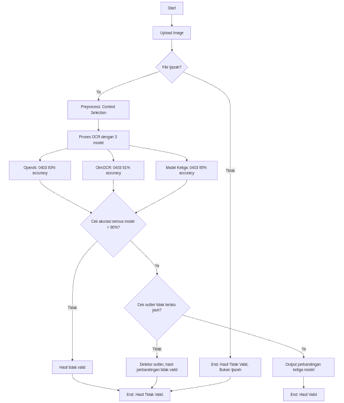

# OCR Ijazah Processing System

## Overview

This system is designed to process scanned images of Indonesian diplomas (Ijazah) and extract key information using Optical Character Recognition (OCR) and image processing techniques. It consists of three main Python scripts:

1.  **`crop_ijazah_info.py`**: This script performs image preprocessing, detects key sections within the Ijazah image (specifically the student information section and the serial number section), and crops these sections for further processing. It employs various techniques, including adaptive thresholding, contour detection, and text-based marker detection (using `pytesseract`), to achieve robust cropping even with variations in image quality and layout.

2.  **`isIjazah.py`**: This script determines whether a given image is likely to be a valid Indonesian Ijazah document. It uses a combination of text-based checks (looking for keywords and phrases commonly found on Ijazahs) and visual feature analysis (checking for borders, layout patterns, and the presence of the national emblem) to make this determination. It returns a confidence score indicating the likelihood of the image being an Ijazah.

3.  **`pipeline.py`**: This script orchestrates the entire OCR processing workflow. It first uses `isIjazah.py` to validate the input image. If the image is deemed a valid Ijazah, it then uses `crop_ijazah_info.py` to extract the student information and serial number sections. Finally, it performs OCR on these cropped sections using both `pytesseract` and the Groq API (with two different models: `llama-3.2-11b-vision-preview` and `llama-3.2-90b-vision-preview`). The results from the different OCR methods are compared, and the best result is selected based on a scoring system. The final output is a JSON object containing the extracted information, confidence scores, and all intermediate OCR results.
   
   

## Installation

1.  **Clone the Repository:**

    ```bash
    git clone https://github.com/stefanus-ai-tech/OCR
    cd OCR
    ```

2. **Change branch to master branch:** 

    ```bash
    git checkout master
    ```

3.  **Install Dependencies:**

    This project requires several Python libraries. Install them using pip:

    ```bash
    pip install -r requirements.txt
    ```

4.  **Install Tesseract OCR:**

    This project uses `pytesseract`, which is a Python wrapper for Google's Tesseract OCR engine. You need to install Tesseract itself:

    -   **Linux (Debian/Ubuntu):**

        ```bash
        sudo apt update
        sudo apt install tesseract-ocr
        sudo apt install libtesseract-dev
        ```
    - **Linux (Fedora/CentOS/RHEL):**
        ```
        sudo yum install tesseract
        ```

    -   **macOS (using Homebrew):**

        ```bash
        brew install tesseract
        ```

    -   **Windows:**

        Download and install Tesseract from the official installer: [https://github.com/UB-Mannheim/tesseract/wiki](https://github.com/UB-Mannheim/tesseract/wiki)

        Make sure to add the Tesseract installation directory to your system's PATH environment variable.

    You also need to install the Indonesian language data for Tesseract:

    ```bash
    sudo apt install tesseract-ocr-ind  # Debian/Ubuntu
    ```
    or download from [https://github.com/tesseract-ocr/tessdata](https://github.com/tesseract-ocr/tessdata) and place in tesseract data folder.

5.  **Groq API Key:**

    Obtain a Groq API key and set it as an environment variable in a `.env` file in the `OCR` directory:

    ```
    GROQ_API_KEY="your_groq_api_key"
    ```
    Replace `"your_groq_api_key"` with your actual API key.

## Usage

### `crop_ijazah_info.py`

This script takes an Ijazah image as input and crops the student information and serial number sections.

**Command-line Arguments:**

-   `image_path`: Path to the Ijazah image file (required).
-   `--debug`: Enable debug mode to save intermediate images (optional).
-   `--output_dir`: Directory to save output images (default: `output`).

**Example:**

```bash
python crop_ijazah_info.py ijazah1.jpg --debug --output_dir my_output
```

This command will process `ijazah1.jpg`, save intermediate images to the `debug_images` directory (if it exists, otherwise it won't save them), and save the cropped student information section as `my_output/student_info.jpg` and the cropped serial number section as `my_output/serial_number.jpg`.

### `isIjazah.py`

This script checks if an image is an Indonesian Ijazah.

**Command-line Arguments:**

-   `image_path`: Path to the image file (required).

**Example:**

```bash
python isIjazah.py ijazah1.jpg
```

This command will print whether the image is detected as an Ijazah and the confidence score.

The script also includes functions for checking multiple images in a directory and for optimizing the detection threshold:

- `check_multiple_images(directory, threshold=0.65)`: Processes all images in a directory.
- `optimize_threshold(directory, known_ijazah=None, known_non_ijazah=None)`: Finds the optimal threshold using a validation set.

### `pipeline.py`

This script runs the complete OCR pipeline.

**Command-line Arguments:**

-   `image_path`: Path to the Ijazah image file (required).

**Example:**

```bash
python pipeline.py ijazah1.jpg
```

This command will process `ijazah1.jpg` and print the extracted information in JSON format to standard output. The JSON output includes:

-   `status`: `"valid"` if the image is a valid Ijazah and processing was successful, `"invalid"` if it's not an Ijazah, or `"error"` if an error occurred.
-   `reason`: (If `status` is `"invalid"` or `"error"`) Explains why the processing failed.
-   `ocr_comparison`:  Details about the comparison of different OCR methods.
    -   `method_scores`: Scores for each OCR method (`pytesseract`, `groq_11b`, `groq_90b`).
    -   `best_method`: The OCR method that produced the best result.
-   `final_output`: The extracted information.
    -   `student_info`:  Student information extracted from the cropped section.
    -   `serial_number`: Serial number extracted from the cropped section.
-   `confidence`: Confidence scores.
    -   `ijazah_detection`: Confidence from `isIjazah.py`.
    -   `has_valid_sections`:  Whether both student info and serial number sections were successfully cropped.
    -   `best_method_score`: The score of the best OCR method.
- `all_results`: Raw results from all OCR methods, for debugging or further analysis.

## Error Handling

-   **`crop_ijazah_info.py`**: If the script fails to detect the "yang bertanda..." marker or the "DN-" marker, it will print a warning message and use a fallback position based on statistical analysis of typical Ijazah layouts.  If critical errors occur during image processing, it prints an error message and traceback.
-   **`isIjazah.py`**: If the script encounters an error while processing an image, it prints an error message and returns `False` with a confidence score of `0.0`.
-   **`pipeline.py`**:  If `isIjazah.py` determines the image is not an Ijazah, it returns a JSON object with `status: "invalid"`. If `crop_ijazah_info.py` fails to crop the required sections, it returns a JSON object with `status: "invalid"`.  If any other error occurs during processing, it returns a JSON object with `status: "error"` and details about the error. The script includes retry logic for the Groq API calls, with exponential backoff.

## Dependencies

-   `opencv-python`: For image processing.
-   `pytesseract`: For OCR using Tesseract.
-   `Pillow`: For image manipulation.
-   `numpy`: For numerical operations.
-   `groq`: For interacting with the Groq API.
-   `python-dotenv`: For loading environment variables from a `.env` file.
-   `difflib`: For fuzzy string matching in `isIjazah.py`.
- Other dependencies listed in `requirements.txt`.
